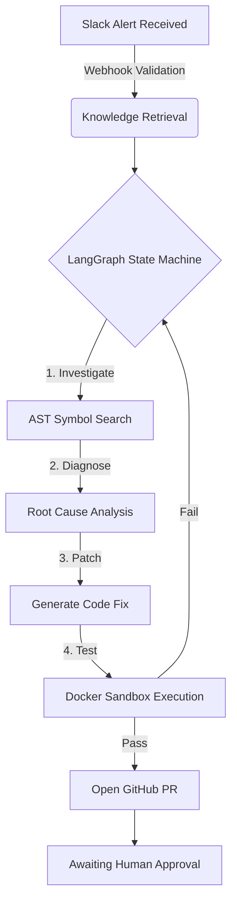

<div align="center">
  

  # IncidentPilot 🚨
  
  **Autonomous AI DevSecOps Agent for Production Incident Remediation**

  [](https://fastapi.tiangolo.com/)
  [](https://nextjs.org/)
  [](https://supabase.com/)
  [](https://langchain.com/)

  *IncidentPilot listens to production alerts, clones the failing repository, builds a mental map of the AST, diagnoses the root cause, writes a patch, tests it in a secure sandbox, and opens a Pull Request—all before a human on-call engineer even wakes up.*
</div>

---

## 🎥 See it in Action

> **[Space reserved for your amazing demo video. You can embed a YouTube link, Loom, or a raw .mp4 here!]**

---

## 🧠 The Architecture

IncidentPilot is not a simple chatbot; it is a full-stack, event-driven state machine built on **LangGraph**. It consists of three decoupled systems:

1. **The Target App**: A Next.js e-commerce application intentionally designed with complex failure modes (e.g., NullPointer Exceptions during checkout, missing inventory bugs). It serves as the test harness.
2. **The Agent Backend**: A FastAPI server powered by LangChain and LangGraph. It ingests cryptographically secured webhooks from Slack/GitHub, indexes codebase Abstract Syntax Trees (AST) using Tree-sitter, and orchestrates the autonomous remediation loops.
3. **The Control Plane (Dashboard)**: A high-fidelity Next.js dashboard providing real-time Server-Sent Events (SSE) streaming of the AI's internal "thought process" and state transitions.

### 🔄 The Remediation Pipeline


---

## 🔒 Enterprise-Grade Security

Because IncidentPilot has the ability to read code and open Pull Requests autonomously, strict security guardrails are enforced at the architectural level:

- **Cryptographic Webhook Validation**: All incoming Slack alerts and GitHub webhooks are verified using mathematical HMAC SHA-256 signature hashing (`X-Hub-Signature-256`, `X-Slack-Signature`) against environment secrets.
- **LLM Prompt Injection Sandboxing**: The agent's file-reading tools are strictly isolated. Hardcoded blocklists prevent the AI from ever accessing `.env`, `secrets.json`, or configuration files, neutralizing malicious payload attempts in error logs.
- **Strict CORS Lockdown**: The backend API is restricted explicitly to authorized frontend domains.
- **Human-in-the-Loop (HITL)**: The agent is restricted from pushing directly to the `main` branch. It can only open Pull Requests, requiring a verified human approval before any production changes are merged.

---

## 🛠️ Technology Stack

- **AI Orchestration**: LangGraph, LangChain, OpenAI/Groq (LLMs)
- **Backend API**: Python, FastAPI, Uvicorn
- **Frontend Dashboard**: Next.js 14, TailwindCSS, Lucide React
- **Database & Vector Store**: Supabase, PostgreSQL (`pgvector`)
- **Code Parsing**: Tree-sitter (AST extraction), SentenceTransformers (Embeddings)
- **Execution Environment**: Sandboxed Docker containers

---

## 🚀 Getting Started

### 1. Prerequisites
- Python 3.10+
- Node.js 18+
- A Supabase Project
- A GitHub Personal Access Token (PAT)
- Slack API Credentials

### 2. Environment Setup

**Backend (`incident-pilot-agent`)**
Create a `.env` file in the backend root:
```env
OPENAI_API_KEY=your_key
SUPABASE_URL=your_url
SUPABASE_SERVICE_ROLE_KEY=your_key
GITHUB_TOKEN=your_pat
SLACK_SIGNING_SECRET=your_slack_secret
GITHUB_WEBHOOK_SECRET=your_github_secret
ALLOWED_ORIGINS=https://incidentpilot.krishnavarshney.in
ENFORCE_WEBHOOK_SECRETS=true
```

### 3. Running Locally
Start the backend server:
```bash
cd backend
pip install -r requirements.txt
uvicorn app.main:app --reload
```

Start the Dashboard / Target App:
```bash
cd frontend
npm install
npm run dev
```

### 4. Indexing a Repository
Before the agent can fix bugs, it needs to understand your codebase. Run the knowledge indexer:
```bash
python run_indexer.py
```
This extracts the AST, generates vector embeddings for every function/class, and syncs them to your Supabase `pgvector` database.

---

## 🤝 Contributing
Contributions are welcome! Please ensure you have read the security architecture guidelines before submitting a PR. The agent will *not* automatically approve your PR 😉.

---

<div align="center">
  <i>Built with passion by <a href="https://krishnavarshney.in">Krishna Varshney</a></i>
</div>
