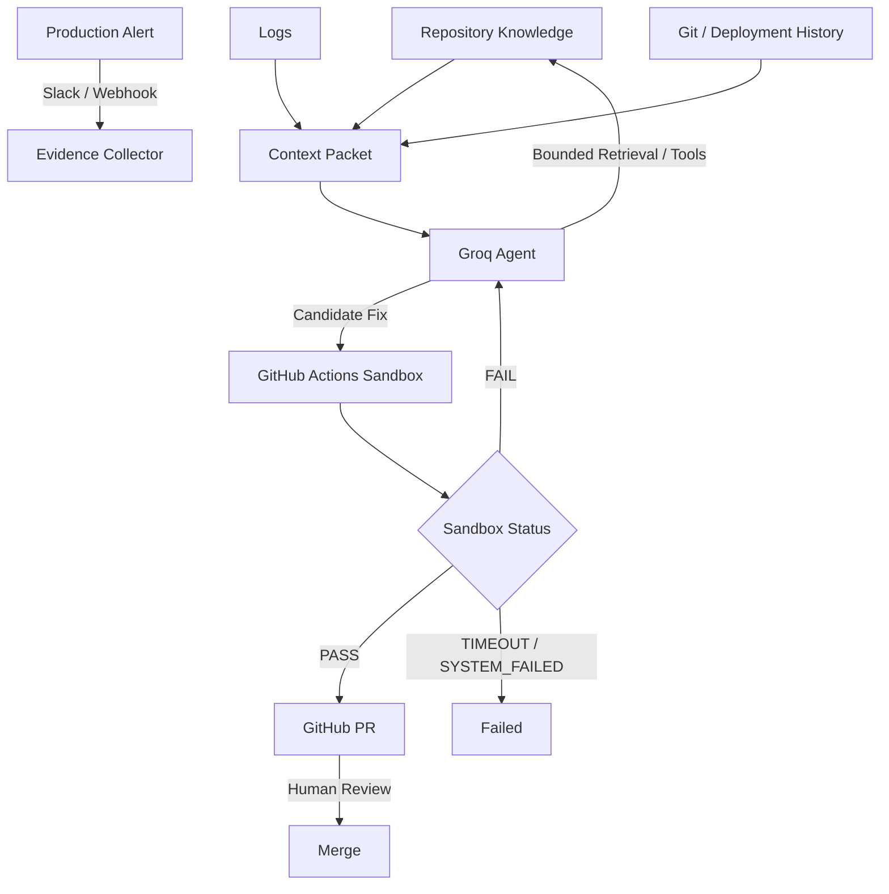

<div align="center">
  
  <h1>IncidentPilot 🚨</h1>
  <p><strong>AI-powered production incident investigation & remediation</strong></p>
  <p>
    <a href="#demo">Demo</a> •
    <a href="#architecture">Architecture</a> •
    <a href="#evaluation">Evaluation</a> •
    <a href="#getting-started">Getting Started</a>
  </p>
  <p>
    
    
  </p>
  <p><em>Status: End-to-end incident → investigation → remediation → sandbox verification → PR flow operational.</em></p>
</div>

IncidentPilot turns production incidents into evidence-backed, tested GitHub pull requests. It builds repository-specific knowledge before an incident occurs, investigates alerts using bounded retrieval, generates candidate fixes, verifies them through sandboxed tests, and keeps a human in the loop before code is merged. IncidentPilot never merges or deploys a generated change autonomously; its output is a reviewable GitHub PR.

## 🎥 Demo

https://github.com/krishna3006b/incident-pilot-agent/raw/master/demo.mp4

## 🧩 The Problem
Production incidents often require engineers to correlate alerts, logs, deployments, code changes, and historical incidents before writing and validating a fix. IncidentPilot automates this investigation loop while keeping the final code change under human review. 

## 🌟 What makes IncidentPilot different?
Most coding agents begin with the incident prompt and search the repository on demand. IncidentPilot starts by building repository knowledge - symbols, semantic code embeddings, dependencies, runbooks and incident history - then constructs a bounded evidence packet for each incident.

The agent is therefore reasoning over selected evidence rather than the entire repository, while still having access to bounded follow-up retrieval when necessary.

## ⚡ How It Works



## 🧠 Knowledge-First Architecture
Don't give a massive monolithic repository directly to an agent. IncidentPilot builds repository knowledge *first*, then constructs a bounded evidence packet for each incident.

`Repository` ↓ `Tree-sitter symbol extraction` ↓ `Semantic code embeddings` ↓ `Dependency graph` ↓ `Incident / runbook memory` ↓ `Production evidence` ↓ `Ranked Context Packet` ↓ `Agent`

The agent starts from a bounded context packet and can request additional evidence through controlled retrieval tools when necessary.

## 🔄 End-to-End Flow

**Agent Execution Trace:**
```text
14:03:02  Incident received
14:03:04  Context packet assembled
14:03:07  Relevant symbols retrieved
14:03:11  Root cause identified
14:03:16  Candidate patch generated
14:03:21  Sandbox started
14:03:47  Sandbox passed
14:03:51  PR created
```

## 🧪 Example: Seeded Production-Like Incident

**🚨 payment-service HTTP 500 rate > 20%**

**IncidentPilot retrieves:**
- ✓ Stack trace 
- ✓ Affected symbol (`PaymentService.ts`)
- ✓ Recent deployment
- ✓ Relevant Git changes
- ✓ Similar historical incident
- ✓ Relevant repository dependencies

**Diagnosis:** Nullable customer address access introduced during the latest payment-flow change.  
**Fix:** Add null-safe handling in `PaymentService`.  
**Verification:** ✓ Sandbox build ✓ Tests passed  
**Result:** GitHub PR created for human review.

## 🏗️ Core Engineering Concepts

### Knowledge-First Retrieval
Repository-specific knowledge is indexed before incidents occur.
### AST-Semantic Code Retrieval
Tree-sitter extracts symbols/classes/functions rather than blindly chunking files.
### Bounded Agent Execution
Context size, tool calls, repair attempts, and execution time are constrained.
### Evidence-Grounded Diagnosis
Agent conclusions reference and validate persisted evidence IDs before being accepted.
### Sandbox Verification
Generated changes are tested asynchronously in an isolated GitHub Actions workflow; a PR is created only after an explicit sandbox PASS.
### Human-in-the-Loop
A human remains responsible for reviewing and merging the generated change.
### Incident Resolution Memory
Verified historical resolutions are persisted and reused during future investigations.

## 📊 Evaluation (Benchmarking)
IncidentPilot is actively evaluated against seeded production-like incidents using:

| Metric | Description |
|---|---|
| **Retrieval accuracy** | Did the relevant code appear in Top-K? |
| **Root-cause accuracy** | Did the agent identify the correct cause? |
| **Fix success rate** | Did the generated patch resolve the issue? |
| **Test pass rate** | Did the patch pass sandbox verification? |
| **Time to PR** | Time from incident to verified PR |
| **Tool calls** | Investigation complexity |
| **Context size** | Tokens/evidence supplied to the model |
| **LLM cost** | Estimated cost per incident |

> **Benchmark setup:** Same incidents, same repository, same test environment; compare fly-blind vs knowledge-first execution.

*(Benchmark results will be published after evaluation on seeded production-like incidents; no performance numbers are claimed before measurement.)*

## 🔐 Security Guardrails

- **Webhook Authentication**: Validates authenticated Slack/GitHub callbacks before processing events.
- **Isolated Sandbox**: Code execution runs securely in ephemeral GitHub Actions runners, never on the backend infrastructure.
- **Human Approval**: Absolutely no direct main-branch commits.
- **Bounded File Retrieval**: Limits which repository/files the agent can request and reduces the blast radius of malicious or irrelevant inputs.

## 🛠️ Tech Stack

**AI / Agent**
Groq, LangGraph, LangChain

**Backend**
Python, FastAPI, Uvicorn

**Knowledge / Retrieval**
Tree-sitter, SentenceTransformers, PostgreSQL, pgvector

**Frontend**
Next.js, TypeScript, Tailwind CSS

**Integrations**
Slack, GitHub API, GitHub Actions

**Streaming / State**
SSE, PostgreSQL

## ⚙️ Architecture Decisions

**Why pgvector?**
Keeps operational state and vector retrieval in PostgreSQL without introducing another datastore.

**Why Tree-sitter?**
Provides structural source-code understanding and semantic chunking.

**Why Knowledge First?**
Avoids flooding the model with irrelevant repository context and provides a bounded, evidence-ranked context for reasoning.

**Why bounded retrieval?**
Controls model cost, latency, and uncontrolled tool execution.

**Why GitHub Actions sandbox?**
Keeps generated code execution completely outside the API process.

**Why human approval?**
The system prepares and verifies changes; it does not autonomously merge production code.

## 🚀 Getting Started

### Prerequisites
- Python 3.x
- Node.js
- Supabase project
- Groq API key
- GitHub credentials
- Slack app/webhook

### Setup
1. Clone the repository
2. Configure environment variables (`.env`)
3. Apply the database schema (`app/db/schema.sql`)
4. Configure the Slack webhook
5. Configure GitHub API credentials
6. Index your target repository
7. Start the backend (`uvicorn main:app --reload`)
8. Start the frontend/dashboard
9. Trigger a test incident

## ⚠️ Current Limitations

- IncidentPilot currently focuses on controlled production-like incidents and repositories configured for its supported runtime profiles.
- Generated changes require human review before merge.
- Incident resolution memory improves as verified incident outcomes accumulate.
- Sandboxed verification is currently implemented through GitHub Actions workflows only.

## 🤝 Contributing
Contributions are welcome. Please open an issue first to discuss what you would like to change.

## Author
Krishna Varshney
